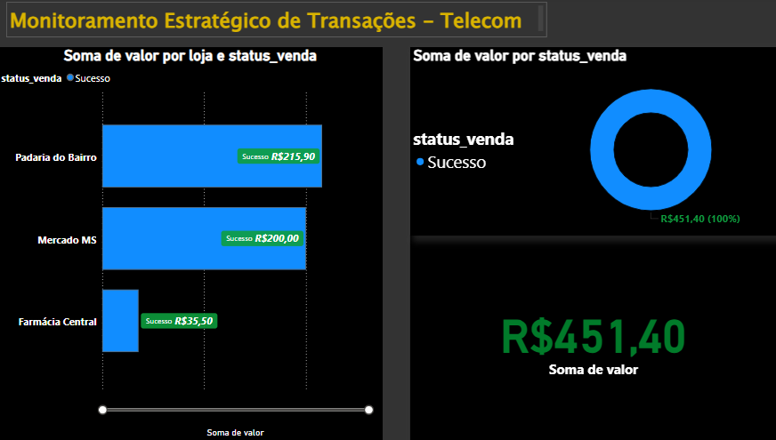

# 📡 Estudo de Caso: Inteligência de Dados em Telecom

### 🚀 Sobre este Projeto
Este repositório reúne um estudo de caso desenvolvido por mim para aplicar ferramentas de tecnologia no setor de Telecomunicações — uma área que já domino e pela qual tenho grande interesse. O foco aqui foi exercitar o uso de lógica de programação e banco de dados para criar camadas de visualização sobre fluxos de informações.

### 🛠️ Tecnologias em Estudo
Como parte do meu aprimoramento contínuo, utilizei este projeto para praticar:
* **Python (Pandas & SQLAlchemy)**: Prática de lógica para organização e estruturação de bases.
* **PostgreSQL & Docker**: Estudo de infraestrutura de dados e bancos relacionais.
* **Power BI**: Desenvolvimento de painéis para transformar dados técnicos em indicadores visuais.

### 💡 Minha Visão
O objetivo deste trabalho é de portfólio pessoal e prática acadêmica. Ele reflete minha dedicação em aprender novas ferramentas que complementem minha experiência operacional, traduzindo o conhecimento que já possuo no setor em uma perspectiva técnica e visual.

### 📊 Painel de Visualização (BI)

---
**Desenvolvido por:** [Karoline Rodrigues da Luz](https://www.linkedin.com/in/karoline-rodrigues-da-luz-80b15b221)
